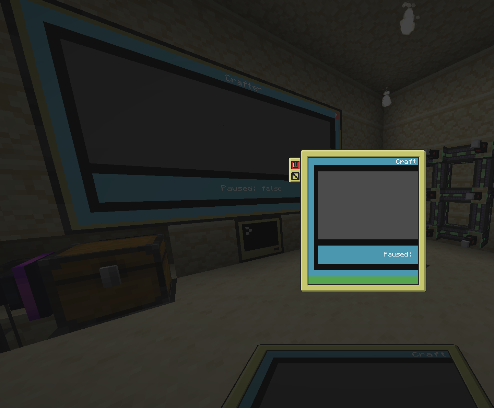

# A collection of peripheral things for ComputerCraft/CC:Tweaked

(There's currently only one, but let's pretend that I will add more things here later...)

## VTerm - A virtual terminal

_Send your screen over rednet!_

For a minimal setup, see the [examples](https://github.com/imevul/peripherals/examples)



### Server setup
```lua
local VTerm = require 'vterm'

-- Optionally, use a monitor on the server.
-- term.current() is used for passthrough target so needs to be setup first
local optionalPassthroughTarget = peripheral.find('monitor')

-- Create virtual terminal server
local vterm = VTerm(optionalModem, optionalPassthroughTarget):host()

-- Redirect terminal output to the virtual terminal.
-- Everything will still be drawn to the previous terminal because the virtual terminal
-- passes forward all calls
term.redirect(vterm)

-- If you need to, you can change the passthrough target using:
-- vterm.redirect(myNewPassthroughTarget)
-- Or just switch primary terminal quickly without forwarding the output to the clients
-- term.redirect(mySecretTerm)

-- This needs to be in your main event loop if you wish to receive events from clients.
-- eventData = { os.pullEvent() }
vterm:handleEvent(eventData)

-- Forward local events if you want to term_resize and monitor_resize to be sent to the client
-- Warning: Overriding the optional filter parameter on the server side to send more events WILL cause problems!
vterm:forwardEvent(eventData)

-- There's also a shortcut if you don't care about your main event loop,
vterm:handleEvents()()
-- or if you use parallel
parallel.waitForAny(vterm:handleEvents())

-- This will show up on all clients!
-- In fact, all cursor moves, write operations, etc. will be forwarded!
print('Hello, world')

-- Close everything when you're done
vterm:close()
```

### Client setup

```lua
local VTerm = require 'vterm'

local id = 1 -- ID of server. Use rednet.lookup('vterm') if you want
local vterm = VTerm(optionalModem):connect(id)

-- Redirect output from server to current local terminal
vterm:redirect(term.current())

-- This needs to be in your main event loop, or things won't work at all
-- eventData = { os.pullEvent() }
vterm:handleEvent(eventData)

-- Forward local events if you want to control the server as well, and not just view it
vterm:forwardEvent(eventData)

-- There's also a shortcut if you don't care about your main event loop,
vterm:handleEvents()()
-- or if you use parallel
parallel.waitForAny(vterm:handleEvents())

-- Redirect back to old term. This vterm is now unusable
vterm.close()
```

### Limitations

You should stop rendering things on the client once you have redirected to the virtual terminal,
otherwise you may run into some visual artifacts, such as flickering.

If the client screen is different size/resolution than the current screen on the server,
you will have a cropped image on the client side. Since the server broadcasts the draw operations to all connected clients,
I don't know of a way around that. (For example, what if all clients have different resolutions?)
